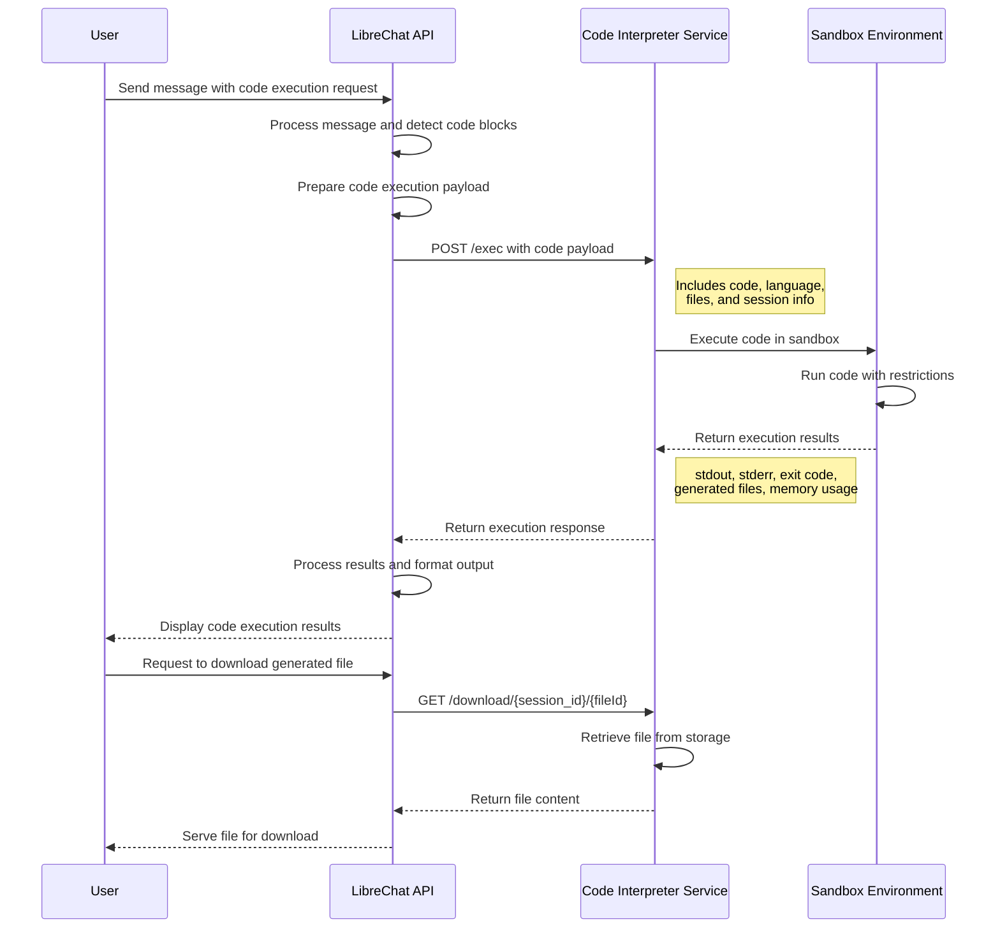

# LibreChat Code Interpreter Sequence Diagram

```mermaid
sequenceDiagram
    participant U as User
    participant LC as LibreChat API
    participant CI as Code Interpreter Service
    participant S as Sandbox Environment

    U->>LC: Send message with code execution request
    LC->>LC: Process message and detect code blocks
    LC->>LC: Prepare code execution payload
    LC->>CI: POST /exec with code payload
    Note right of CI: Includes code, language,<br/>files, and session info
    
    CI->>S: Execute code in sandbox
    S->>S: Run code with restrictions
    S-->>CI: Return execution results
    Note right of CI: stdout, stderr, exit code,<br/>generated files, memory usage
    
    CI-->>LC: Return execution response
    LC->>LC: Process results and format output
    LC-->>U: Display code execution results
    
    U->>LC: Request to download generated file
    LC->>CI: GET /download/{session_id}/{fileId}
    CI->>CI: Retrieve file from storage
    CI-->>LC: Return file content
    LC-->>U: Serve file for download
```